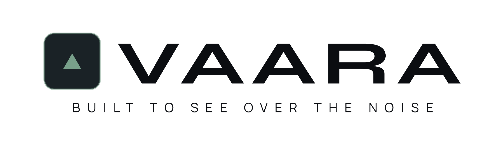

<p align="center">
  <picture>
    <source media="(prefers-color-scheme: dark)" srcset="docs/vaara-wordmark-dark.png">
    
  </picture>
</p>

<p align="center">
  <a href="https://pypi.org/project/vaara/"></a>
  <a href="https://pypi.org/project/vaara/"></a>
  <a href="https://github.com/vaaraio/vaara/blob/main/LICENSE"></a>
  <a href="https://github.com/vaaraio/vaara/actions/workflows/ci.yml"></a>
  <a href="https://scorecard.dev/viewer/?uri=github.com/vaaraio/vaara"></a>
  <a href="https://www.bestpractices.dev/projects/12612"></a>
</p>

Adaptive AI agent execution layer. Sits between agents and actions, scores risk in real time, and produces evidence artefacts that support EU AI Act Article 14 human-oversight and Article 12 logging obligations.

> Vaara is a tool that helps deployers assemble evidence for their own
> conformity work. It does not itself conduct conformity assessments,
> certify compliance, or constitute legal advice. Deployers remain
> responsible for their obligations under the EU AI Act and other
> applicable law.

**Three questions for every agent action:**
1. Should this happen? (adaptive risk scoring with conformal prediction)
2. What is this? (action taxonomy with regulatory classification)
3. What happened and why? (hash-chained audit trail)

## Why Vaara

AI governance tools audit **models**. Vaara governs **actions**.

Models are scored once at deployment. Agents act continuously at runtime -- calling tools, moving money, modifying infrastructure. Individual actions may be safe, but *sequences* can be catastrophic. `read_data` + `export_data` + `delete_data` is a data exfiltration pattern where each step alone is benign.

Vaara catches this. It learns which risk signals predict bad outcomes, adapts its scoring online, and wraps every estimate in a distribution-free confidence interval. No retraining. No manual threshold tuning.

## Install

```bash
pip install vaara
```

Python 3.10+. Zero runtime dependencies.

## Quick Start

```python
from vaara.pipeline import InterceptionPipeline

pipeline = InterceptionPipeline()

# Agent wants to execute a tool
result = pipeline.intercept(
    agent_id="agent-007",
    tool_name="fs.write_file",
    parameters={"path": "/etc/service.yaml", "content": "..."},
    agent_confidence=0.8,
)

if result.allowed:
    execute_tool("fs.write_file", {"path": "/etc/service.yaml", "content": "..."})
    # Report outcome so the scorer learns
    pipeline.report_outcome(result.action_id, outcome_severity=0.0)
else:
    print(f"Blocked: {result.reason}")
    # result.decision is "deny" or "escalate"
    # result.risk_score and result.risk_interval available
```

## How It Works

### Risk Scoring (Adaptive)

Five expert signals scored per action, combined via [Multiplicative Weight Update](https://theory.epfl.ch/osMDPs/papers/AroraHK12.pdf):

| Signal | What it measures |
|--------|-----------------|
| **Taxonomy base** | Static risk from action metadata (reversibility, blast radius, urgency) |
| **Agent history** | This agent's track record (denial rate, bad outcomes) |
| **Sequence pattern** | Dangerous action sequences (data exfiltration, privilege escalation, unauthorized tool chaining) |
| **Burst detection** | Unusual action frequency spikes |
| **Confidence gap** | High confidence on high-risk actions = suspicious |

MWU learns which signals actually predict bad outcomes and shifts weight toward them. It carries a theoretical regret bound of O(√(T log N)) against the best fixed expert in hindsight (Arora–Hazan–Kale 2012).

### Conformal Prediction

Every risk score is wrapped in a [conformal prediction interval](https://arxiv.org/abs/2107.07511):

```
P(true_risk in [lower, upper]) >= 1 - alpha
```

No distributional assumptions. No model retraining. The decision uses the **upper bound** -- conservative by construction. Under distribution shift, [FACI](https://arxiv.org/abs/2106.00170) adaptive alpha maintains long-run coverage.

### Decisions

```
ALLOW     — upper bound < 0.3 (configurable)
ESCALATE  — between 0.3 and 0.7 → route to human
DENY      — upper bound > 0.7
```

Cold start is maximally cautious: wide intervals route most actions through human review. As outcomes accumulate, intervals tighten and the system becomes autonomous.

## Framework Integrations

### LangChain

```python
from vaara.integrations.langchain import VaaraCallbackHandler

pipeline = InterceptionPipeline()
handler = VaaraCallbackHandler(pipeline, agent_id="my-agent")
agent = create_react_agent(llm, tools)

result = agent.invoke(
    {"messages": [("user", "...")]},
    config={"callbacks": [handler]},
)
```

### OpenAI Agents SDK

```python
from vaara.integrations.openai_agents import VaaraToolGuardrail

pipeline = InterceptionPipeline()
guardrail = VaaraToolGuardrail(pipeline)
agent = Agent(name="my-agent", tools=[...], output_guardrails=[guardrail])
```

### CrewAI

```python
from vaara.integrations.crewai import VaaraCrewGovernance

pipeline = InterceptionPipeline()
gov = VaaraCrewGovernance(pipeline)
safe_crew = gov.governed_kickoff(crew)
```

### MCP Server (Claude Code, Cursor)

```bash
python -m vaara.integrations.mcp_server
```

Add to Claude Code settings:
```json
{
  "mcpServers": {
    "vaara": {
      "command": "python",
      "args": ["-m", "vaara.integrations.mcp_server"]
    }
  }
}
```

## Compliance evidence

Vaara collects and maps evidence artefacts to specific article references
in the EU AI Act and DORA. The output is evidence, not a conformity
verdict — the deployer, with a Notified Body where applicable, owns the
conformity decision.

```python
report = pipeline.run_compliance_assessment(
    system_name="My Agent System",
    system_version="1.0.0",
)

# Article-by-article evidence mapping
for article in report.articles:
    print(f"{article.requirement.article}: {article.status.value}")
    # Article 9(1): evidence_sufficient
    # Article 12(1): evidence_sufficient
    # ...
```

**Article references covered:**
- EU AI Act: Articles 9, 11–15, 61 (risk management, documentation,
  logging, transparency, human oversight, accuracy, post-market
  monitoring)
- DORA: Articles 10, 12, 13 (ICT risk management, incident detection,
  incident response)

The audit trail is hash-chained (SHA-256) and tamper-evident, which
supports Article 12(1) record-keeping obligations when configured with
the deployer's required log content.

## Cold Start

Generate synthetic traces to pre-calibrate the scorer:

```python
from vaara.sandbox.trace_gen import TraceGenerator

gen = TraceGenerator()
traces = gen.generate(n_traces=100)
gen.pre_calibrate(pipeline, traces)
# Calibration in minutes instead of hours
```

Three agent archetypes (benign, careless, adversarial) with realistic outcome distributions.

## Architecture

```
Agent (LangChain / OpenAI / CrewAI / MCP)
    |
    v
InterceptionPipeline.intercept()
    |
    +-- ActionRegistry     ->  classify tool_name to ActionType
    +-- AdaptiveScorer     ->  MWU + conformal risk interval
    +-- AuditTrail         ->  hash-chained immutable log
    +-- ComplianceEngine   ->  EU AI Act + DORA evidence mapping
    |
    v
InterceptionResult { allowed, risk_score, risk_interval, reason }
    |
    v
Execute or Block
    |
    v
report_outcome()  ->  closes feedback loop, MWU learns
```

## Persistence

```python
from vaara.audit.sqlite_backend import SQLiteAuditBackend

backend = SQLiteAuditBackend("audit.db")
trail = AuditTrail(on_record=backend.write_record)
pipeline = InterceptionPipeline(trail=trail)
```

WAL-mode SQLite, append-only, hash chain verified on load.

## Formal Specification

See [docs/formal_specification.md](docs/formal_specification.md) for the mathematical foundations: MWU regret bounds, conformal coverage guarantees, convergence rates, and security properties.

## Tests

```bash
pip install vaara[dev]
pytest
```

200+ tests, runs in <1s.

## License

See [LICENSE](LICENSE).
